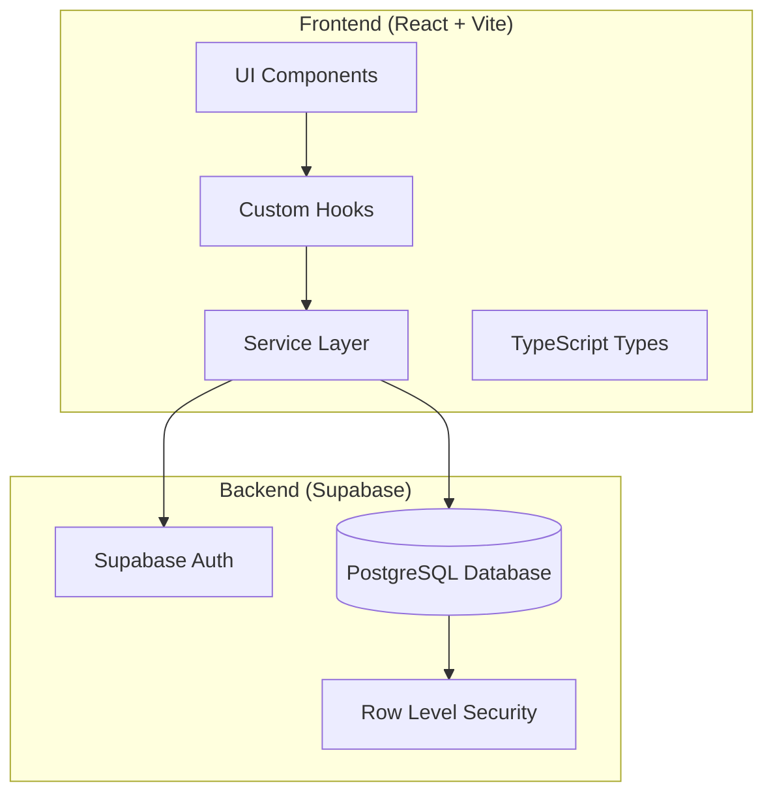

# Design Document: TrendyGenie Admin Panel

## Overview

The TrendyGenie Admin Panel is a React-based web application that provides administrative capabilities for managing the TrendyGenie marketplace platform. Built with Vite, TypeScript, TailwindCSS, and HeroUI, it follows a modular architecture with clear separation between UI components, business logic (hooks), and data services.

The application uses Supabase for authentication, database operations, and real-time subscriptions. The UI follows a responsive two-panel layout with a fixed sidebar for navigation and a scrollable main content area.

## Architecture



### Layer Responsibilities

1. **UI Components**: React components using HeroUI, responsible for rendering and user interaction
2. **Custom Hooks**: Encapsulate data fetching, mutations, and state management logic
3. **Service Layer**: Direct Supabase client interactions, query building, and error handling
4. **Types**: TypeScript interfaces for all data models and API responses

## Components and Interfaces

### Project Structure

```
admin/
├── src/
│   ├── components/
│   │   ├── common/
│   │   │   ├── SummaryCard.tsx
│   │   │   ├── DataCard.tsx
│   │   │   ├── ConfirmModal.tsx
│   │   │   ├── DetailModal.tsx
│   │   │   ├── Pagination.tsx
│   │   │   ├── SearchInput.tsx
│   │   │   ├── FilterDropdown.tsx
│   │   │   └── LoadingSpinner.tsx
│   │   ├── layout/
│   │   │   ├── Sidebar.tsx
│   │   │   ├── Header.tsx
│   │   │   ├── MainLayout.tsx
│   │   │   └── MobileNav.tsx
│   │   └── pages/
│   │       ├── users/
│   │       │   ├── UserCard.tsx
│   │       │   ├── UserDetailModal.tsx
│   │       │   └── UserFilters.tsx
│   │       ├── companies/
│   │       │   ├── CompanyCard.tsx
│   │       │   ├── CompanyDetailModal.tsx
│   │       │   └── CompanyFilters.tsx
│   │       ├── businesses/
│   │       │   ├── BusinessCard.tsx
│   │       │   ├── BusinessDetailModal.tsx
│   │       │   └── BusinessFilters.tsx
│   │       ├── services/
│   │       │   ├── ServiceCard.tsx
│   │       │   ├── ServiceDetailModal.tsx
│   │       │   └── ServiceFilters.tsx
│   │       ├── legal/
│   │       │   ├── LegalPageCard.tsx
│   │       │   ├── LegalPageEditor.tsx
│   │       │   └── LegalPageModal.tsx
│   │       └── transactions/
│   │           ├── TransactionCard.tsx
│   │           ├── TransactionDetailModal.tsx
│   │           └── TransactionFilters.tsx
│   ├── constants/
│   │   ├── routes.ts
│   │   ├── status.ts
│   │   └── config.ts
│   ├── hooks/
│   │   ├── useAuth.ts
│   │   ├── useUsers.ts
│   │   ├── useCompanies.ts
│   │   ├── useBusinesses.ts
│   │   ├── useServices.ts
│   │   ├── useLegalPages.ts
│   │   ├── useTransactions.ts
│   │   └── usePagination.ts
│   ├── pages/
│   │   ├── LoginPage.tsx
│   │   ├── RegisterPage.tsx
│   │   ├── DashboardPage.tsx
│   │   ├── UsersPage.tsx
│   │   ├── CompaniesPage.tsx
│   │   ├── BusinessesPage.tsx
│   │   ├── ServicesPage.tsx
│   │   ├── LegalPagesPage.tsx
│   │   └── TransactionsPage.tsx
│   ├── services/
│   │   ├── supabase.ts
│   │   ├── authService.ts
│   │   ├── userService.ts
│   │   ├── companyService.ts
│   │   ├── businessService.ts
│   │   ├── serviceService.ts
│   │   ├── legalPageService.ts
│   │   └── transactionService.ts
│   ├── types/
│   │   ├── user.ts
│   │   ├── company.ts
│   │   ├── business.ts
│   │   ├── service.ts
│   │   ├── legalPage.ts
│   │   ├── transaction.ts
│   │   └── common.ts
│   ├── utils/
│   │   ├── formatters.ts
│   │   ├── validators.ts
│   │   └── helpers.ts
│   ├── App.tsx
│   ├── main.tsx
│   ├── index.css          # TailwindCSS imports and custom styles
│   └── vite-env.d.ts
├── .env
├── .env.example
├── index.html
├── package.json
├── tailwind.config.js
├── tsconfig.json
└── vite.config.ts
```

### Brand Colors

The admin panel uses TrendyGenie's brand colors configured in TailwindCSS:

```javascript
// tailwind.config.js
module.exports = {
  theme: {
    extend: {
      colors: {
        primary: {
          DEFAULT: '#16C79A',  // Main brand color (0xFF16C79A)
          50: '#E8FBF5',
          100: '#D1F7EB',
          200: '#A3EFD7',
          300: '#75E7C3',
          400: '#47DFAF',
          500: '#16C79A',      // Base
          600: '#12A07B',
          700: '#0E785C',
          800: '#0A503D',
          900: '#05281F',
        },
      },
    },
  },
};
```

```css
/* src/index.css */
@tailwind base;
@tailwind components;
@tailwind utilities;

/* Custom component styles */
@layer components {
  .btn-primary {
    @apply bg-primary-500 hover:bg-primary-600 text-white font-medium py-2 px-4 rounded-lg transition-colors;
  }
  
  .card-hover {
    @apply hover:shadow-lg hover:border-primary-200 transition-all duration-200;
  }
}
```

### HeroUI Toast Setup

The admin panel uses HeroUI's built-in toast system for notifications:

```typescript
// App.tsx setup
import { HeroUIProvider, ToastProvider } from '@heroui/react';
import { addToast } from '@heroui/react';

function App() {
  return (
    <HeroUIProvider>
      <ToastProvider placement="bottom-right" maxVisibleToasts={3}>
        {/* App content */}
      </ToastProvider>
    </HeroUIProvider>
  );
}

// Usage in components
const showSuccess = (message: string) => {
  addToast({
    title: 'Success',
    description: message,
    color: 'success',
    timeout: 4000,
  });
};

const showError = (message: string) => {
  addToast({
    title: 'Error',
    description: message,
    color: 'danger',
    timeout: 6000,
  });
};
```

### Core Component Interfaces

```typescript
// types/common.ts
interface PaginationParams {
  page: number;
  pageSize: number;
  sortBy?: string;
  sortOrder?: 'asc' | 'desc';
}

interface PaginatedResponse<T> {
  data: T[];
  total: number;
  page: number;
  pageSize: number;
  totalPages: number;
}

interface SummaryCardProps {
  title: string;
  value: number;
  icon: React.ReactNode;
  trend?: {
    value: number;
    isPositive: boolean;
  };
  onClick?: () => void;
}

interface DataCardProps<T> {
  item: T;
  onView: (item: T) => void;
  onStatusChange: (item: T, status: string) => void;
  onDelete: (item: T) => void;
}

interface FilterOption {
  label: string;
  value: string;
}

interface ModalProps {
  isOpen: boolean;
  onClose: () => void;
  title: string;
  children: React.ReactNode;
}
```

### Service Layer Interfaces

```typescript
// services/userService.ts
interface UserService {
  getUsers(params: UserQueryParams): Promise<PaginatedResponse<User>>;
  getUserById(id: string): Promise<User>;
  updateUserStatus(id: string, isActive: boolean): Promise<void>;
  deleteUser(id: string): Promise<void>;
  getUserStats(): Promise<UserStats>;
}

// services/companyService.ts
interface CompanyService {
  getCompanies(params: CompanyQueryParams): Promise<PaginatedResponse<Company>>;
  getCompanyById(id: string): Promise<Company>;
  updateCompanyStatus(id: string, status: CompanyStatus): Promise<void>;
  deleteCompany(id: string): Promise<void>;
  getCompanyStats(): Promise<CompanyStats>;
}

// services/businessService.ts
interface BusinessService {
  getBusinesses(params: BusinessQueryParams): Promise<PaginatedResponse<Business>>;
  getBusinessById(id: string): Promise<Business>;
  updateBusinessStatus(id: string, status: BusinessStatus): Promise<void>;
  deleteBusiness(id: string): Promise<void>;
  getBusinessStats(): Promise<BusinessStats>;
}

// services/serviceService.ts
interface ServiceService {
  getServices(params: ServiceQueryParams): Promise<PaginatedResponse<Service>>;
  getServiceById(id: string): Promise<Service>;
  updateServiceStatus(id: string, status: ServiceStatus): Promise<void>;
  deleteService(id: string): Promise<void>;
  getServiceStats(): Promise<ServiceStats>;
}

// services/legalPageService.ts
interface LegalPageService {
  getLegalPages(): Promise<LegalPage[]>;
  getLegalPageById(id: string): Promise<LegalPage>;
  createLegalPage(data: CreateLegalPageInput): Promise<LegalPage>;
  updateLegalPage(id: string, data: UpdateLegalPageInput): Promise<LegalPage>;
  deleteLegalPage(id: string): Promise<void>;
}

// services/transactionService.ts
interface TransactionService {
  getTransactions(params: TransactionQueryParams): Promise<PaginatedResponse<Transaction>>;
  getTransactionById(id: string): Promise<Transaction>;
  getTransactionStats(): Promise<TransactionStats>;
}
```

### Custom Hook Interfaces

```typescript
// hooks/useUsers.ts
interface UseUsersReturn {
  users: User[];
  loading: boolean;
  error: Error | null;
  stats: UserStats | null;
  pagination: PaginationState;
  filters: UserFilters;
  setFilters: (filters: UserFilters) => void;
  setPage: (page: number) => void;
  updateStatus: (id: string, isActive: boolean) => Promise<void>;
  deleteUser: (id: string) => Promise<void>;
  refetch: () => void;
}

// Similar patterns for other hooks...
```

## Data Models

### User Model

```typescript
interface User {
  id: string;
  full_name: string;
  email: string;
  phone_number: string | null;
  profile_image: string | null;
  user_type: 'customer' | 'provider' | 'admin';
  is_active: boolean;
  is_email_verified: boolean;
  is_phone_verified: boolean;
  created_at: string;
  updated_at: string;
}

interface UserStats {
  total: number;
  active: number;
  inactive: number;
  customers: number;
  providers: number;
  admins: number;
}

interface UserFilters {
  userType?: 'customer' | 'provider' | 'admin';
  isActive?: boolean;
  search?: string;
}
```

### Company Model

```typescript
interface Company {
  id: string;
  name: string;
  registration_number: string;
  address: string;
  category_id: string | null;
  owner_id: string;
  status: 'pending' | 'approved' | 'rejected' | 'suspended';
  company_logo: string | null;
  owner_id_image: string | null;
  selfie_image: string | null;
  is_verified: boolean;
  description: string | null;
  website: string | null;
  email: string | null;
  phone: string | null;
  latitude: number | null;
  longitude: number | null;
  city: string | null;
  country: string | null;
  postal_code: string | null;
  total_orders: number;
  rating: number;
  review_count: number;
  created_at: string;
  updated_at: string;
  approved_at: string | null;
  // Joined data
  owner?: User;
  category?: Category;
}

interface CompanyStats {
  total: number;
  pending: number;
  approved: number;
  rejected: number;
  suspended: number;
}

interface CompanyFilters {
  status?: CompanyStatus;
  categoryId?: string;
  search?: string;
}
```

### Business Model

```typescript
interface Business {
  id: string;
  name: string;
  description: string | null;
  logo_url: string | null;
  address: string;
  contact_email: string;
  contact_phone: ContactPhone[];
  company_id: string;
  category_id: string | null;
  subcategory_id: string | null;
  status: 'pending' | 'active' | 'rejected' | 'suspended' | 'removed' | 'deleted';
  rating: number;
  business_hours: BusinessHour[];
  latitude: number | null;
  longitude: number | null;
  currency: string;
  created_at: string;
  updated_at: string;
  // Joined data
  company?: Company;
  category?: Category;
  subcategory?: Subcategory;
}

interface BusinessStats {
  total: number;
  active: number;
  pending: number;
  suspended: number;
  rejected: number;
}

interface BusinessFilters {
  status?: BusinessStatus;
  categoryId?: string;
  companyId?: string;
  search?: string;
}
```

### Service Model

```typescript
interface Service {
  id: string;
  title: string;
  description: string | null;
  category_id: string;
  images: string[];
  rating: number;
  distance: number;
  status: 'pending' | 'active' | 'rejected' | 'suspended' | 'deleted' | 'requestDeletion';
  normal_price: number;
  promotional_price: number;
  currency: string;
  bedroom_count: number | null;
  bathroom_count: number | null;
  has_kitchen: boolean | null;
  property_type: string | null;
  cuisine: string | null;
  is_delivery_available: boolean | null;
  food_category: string | null;
  caracteristics: Record<string, any> | null;
  provider_id: string;
  business_id: string | null;
  company_id: string | null;
  created_by: string | null;
  is_active: boolean;
  view_count: number;
  metadata: Record<string, any> | null;
  created_at: string;
  updated_at: string;
  // Joined data
  business?: Business;
  category?: Category;
  provider?: User;
}

interface ServiceStats {
  total: number;
  active: number;
  pending: number;
  suspended: number;
  rejected: number;
}

interface ServiceFilters {
  status?: ServiceStatus;
  categoryId?: string;
  businessId?: string;
  search?: string;
}
```

### Legal Page Model

```typescript
interface LegalPage {
  id: string;
  title: string;
  slug: string;
  page_type: 'terms' | 'privacy' | 'refund' | 'cookie' | 'other';
  content: string; // HTML content
  is_active: boolean;
  created_at: string;
  updated_at: string;
}

interface CreateLegalPageInput {
  title: string;
  slug: string;
  page_type: LegalPageType;
  content: string;
}

interface UpdateLegalPageInput {
  title?: string;
  content?: string;
  is_active?: boolean;
}
```

### Transaction Model

```typescript
interface Transaction {
  id: string;
  order_id: string;
  customer_id: string;
  business_id: string | null;
  company_id: string | null;
  amount: number;
  currency: string;
  payment_method: string;
  payment_provider: PaymentProvider;
  provider_payment_id: string | null;
  status: 'pending' | 'completed' | 'failed' | 'refunded' | 'cancelled' | 'processing';
  transaction_fee: number;
  description: string | null;
  receipt_url: string | null;
  metadata: Record<string, any> | null;
  created_at: string;
  updated_at: string;
  // Joined data
  customer?: User;
  order?: Order;
  business?: Business;
}

interface TransactionStats {
  total: number;
  totalRevenue: number;
  pending: number;
  completed: number;
  failed: number;
  refunded: number;
}

interface TransactionFilters {
  status?: TransactionStatus;
  paymentProvider?: PaymentProvider;
  dateFrom?: string;
  dateTo?: string;
  search?: string;
}
```

### Database Migration for Legal Pages

```sql
-- Create legal_pages table
CREATE TABLE IF NOT EXISTS public.legal_pages (
  id UUID PRIMARY KEY DEFAULT gen_random_uuid(),
  title TEXT NOT NULL,
  slug TEXT NOT NULL UNIQUE,
  page_type TEXT NOT NULL CHECK (page_type IN ('terms', 'privacy', 'refund', 'cookie', 'other')),
  content TEXT NOT NULL DEFAULT '',
  is_active BOOLEAN NOT NULL DEFAULT true,
  created_at TIMESTAMPTZ NOT NULL DEFAULT now(),
  updated_at TIMESTAMPTZ NOT NULL DEFAULT now()
);

-- Enable RLS
ALTER TABLE public.legal_pages ENABLE ROW LEVEL SECURITY;

-- Policy for admins to manage legal pages
CREATE POLICY "Admins can manage legal pages" ON public.legal_pages
  FOR ALL
  USING (
    EXISTS (
      SELECT 1 FROM public.users
      WHERE users.id = auth.uid()
      AND users.user_type = 'admin'
    )
  );

-- Policy for public read access to active pages
CREATE POLICY "Public can read active legal pages" ON public.legal_pages
  FOR SELECT
  USING (is_active = true);
```


## Correctness Properties

*A property is a characteristic or behavior that should hold true across all valid executions of a system—essentially, a formal statement about what the system should do. Properties serve as the bridge between human-readable specifications and machine-verifiable correctness guarantees.*

Based on the prework analysis, the following correctness properties have been identified. Redundant properties have been consolidated to provide unique validation value.

### Property 1: Protected Route Access Control

*For any* protected route in the admin panel and any unauthenticated user, attempting to access that route SHALL result in a redirect to the login page.

**Validates: Requirements 1.5**

### Property 2: Invalid Credentials Rejection

*For any* login attempt with invalid credentials (wrong email, wrong password, or non-admin user), the system SHALL display an error message and remain on the login page without granting access.

**Validates: Requirements 1.3**

### Property 3: Password Validation

*For any* password that does not meet security requirements (minimum length, complexity), the registration form SHALL display appropriate validation errors and prevent submission.

**Validates: Requirements 2.5**

### Property 4: Summary Card Accuracy

*For any* management section (users, companies, businesses, services, transactions), the summary card counts SHALL equal the actual count of records in the database matching each category.

**Validates: Requirements 3.3, 4.1, 5.1, 6.1, 7.1, 9.1**

### Property 5: Data Card Display Completeness

*For any* entity displayed in a HeroUI card (user, company, business, service, legal page, transaction), the card SHALL contain all required fields as specified in the requirements.

**Validates: Requirements 4.2, 5.2, 6.2, 7.2, 8.1, 9.2**

### Property 6: Status Update Persistence

*For any* entity (user, company, business, service) and any valid status change, updating the status SHALL persist the new value to Supabase and the UI SHALL reflect the updated status after refresh.

**Validates: Requirements 4.4, 5.4, 5.5, 6.4, 7.4**

### Property 7: Delete Operation Completeness

*For any* entity (user, company, business, service, legal page) that is deleted after confirmation, the record SHALL no longer exist in the Supabase database.

**Validates: Requirements 4.5, 5.6, 6.5, 7.5, 8.5**

### Property 8: Filter Result Accuracy

*For any* filter combination applied to a list (users, companies, businesses, services, transactions), all returned results SHALL match the filter criteria and no matching results SHALL be excluded.

**Validates: Requirements 4.6, 4.7, 5.7, 6.6, 7.6, 9.4, 9.5**

### Property 9: Legal Page Content Persistence

*For any* legal page content update, saving the changes SHALL persist the exact HTML content to Supabase, and retrieving the page SHALL return the same content (round-trip property).

**Validates: Requirements 8.3**

### Property 10: Pagination Data Integrity

*For any* paginated list and any page number within valid range, the returned data SHALL contain exactly the expected number of items (or fewer for the last page) and SHALL not overlap with other pages.

**Validates: Requirements 11.1, 11.3**

### Property 11: Sort Order Consistency

*For any* sortable column and any sort direction (asc/desc), the returned data SHALL be ordered according to the specified column and direction.

**Validates: Requirements 11.2**

### Property 12: Filter Pagination Reset

*For any* filter change applied to a paginated list, the pagination SHALL reset to page 1.

**Validates: Requirements 11.4**

### Property 13: Operation Feedback

*For any* successful operation (create, update, delete), the system SHALL display a success toast notification. *For any* failed operation, the system SHALL display an error toast with a descriptive message.

**Validates: Requirements 12.1, 12.2**

### Property 14: Form Validation Feedback

*For any* form field with invalid input, the system SHALL display an inline error message adjacent to that field.

**Validates: Requirements 12.4**

### Property 15: Destructive Action Confirmation

*For any* destructive action (delete), the system SHALL display a confirmation dialog before executing the operation.

**Validates: Requirements 12.5**

## Error Handling

### Authentication Errors

| Error Type | Handling Strategy |
|------------|-------------------|
| Invalid credentials | Display error toast, clear password field, remain on login page |
| Session expired | Redirect to login page with session expired message |
| Unauthorized access | Redirect to login page, clear local storage |
| Network error during auth | Display connection error with retry button |

### API Errors

| Error Type | Handling Strategy |
|------------|-------------------|
| 400 Bad Request | Display validation errors inline on form fields |
| 401 Unauthorized | Redirect to login page |
| 403 Forbidden | Display permission denied message |
| 404 Not Found | Display "Resource not found" message, offer navigation back |
| 500 Server Error | Display generic error toast with retry option |
| Network timeout | Display connection error with retry button |

### Form Validation Errors

| Field Type | Validation Rules |
|------------|------------------|
| Email | Required, valid email format |
| Password | Required, minimum 8 characters, at least one uppercase, one lowercase, one number |
| Required fields | Non-empty after trimming whitespace |
| HTML content | Non-empty, valid HTML structure |

### Error Boundary Strategy

```typescript
// Wrap main app sections with error boundaries
<ErrorBoundary fallback={<ErrorFallback />}>
  <MainContent />
</ErrorBoundary>

// ErrorFallback component provides:
// - User-friendly error message
// - "Try Again" button to reset error state
// - "Go to Dashboard" link for navigation
```

## Testing Strategy

### Testing Framework

- **Unit Testing**: Vitest with React Testing Library
- **Property-Based Testing**: fast-check library for TypeScript
- **E2E Testing**: Playwright (optional, for critical flows)

### Test Configuration

```typescript
// vitest.config.ts
export default defineConfig({
  test: {
    environment: 'jsdom',
    setupFiles: ['./src/test/setup.ts'],
    coverage: {
      provider: 'v8',
      reporter: ['text', 'json', 'html'],
    },
  },
});
```

### Unit Tests

Unit tests focus on specific examples and edge cases:

1. **Component Rendering**: Verify components render with correct props
2. **User Interactions**: Test click handlers, form submissions
3. **Hook Behavior**: Test custom hooks with mock Supabase client
4. **Service Functions**: Test API call construction and response handling
5. **Utility Functions**: Test formatters, validators, helpers

### Property-Based Tests

Property tests verify universal properties across generated inputs. Each property test runs minimum 100 iterations.

```typescript
// Example property test structure
import { fc } from 'fast-check';

describe('Filter Result Accuracy', () => {
  // Feature: trendygenie-admin-panel, Property 8: Filter Result Accuracy
  it('should return only users matching the filter criteria', () => {
    fc.assert(
      fc.property(
        fc.record({
          userType: fc.constantFrom('customer', 'provider', 'admin', undefined),
          isActive: fc.boolean(),
        }),
        fc.array(arbitraryUser(), { minLength: 0, maxLength: 50 }),
        (filters, users) => {
          const result = filterUsers(users, filters);
          return result.every(user => 
            (filters.userType === undefined || user.user_type === filters.userType) &&
            user.is_active === filters.isActive
          );
        }
      ),
      { numRuns: 100 }
    );
  });
});
```

### Test Coverage Requirements

| Category | Minimum Coverage |
|----------|------------------|
| Services | 90% |
| Hooks | 85% |
| Utils | 95% |
| Components | 75% |

### Property Test Mapping

| Property | Test File | Description |
|----------|-----------|-------------|
| Property 1 | `auth.property.test.ts` | Route protection |
| Property 2 | `auth.property.test.ts` | Invalid credentials |
| Property 3 | `validation.property.test.ts` | Password validation |
| Property 4 | `summaryCard.property.test.ts` | Count accuracy |
| Property 5 | `dataCard.property.test.ts` | Field completeness |
| Property 6 | `statusUpdate.property.test.ts` | Status persistence |
| Property 7 | `delete.property.test.ts` | Delete completeness |
| Property 8 | `filter.property.test.ts` | Filter accuracy |
| Property 9 | `legalPage.property.test.ts` | Content round-trip |
| Property 10 | `pagination.property.test.ts` | Data integrity |
| Property 11 | `sort.property.test.ts` | Sort consistency |
| Property 12 | `pagination.property.test.ts` | Filter reset |
| Property 13 | `notification.property.test.ts` | Operation feedback |
| Property 14 | `validation.property.test.ts` | Form validation |
| Property 15 | `confirmation.property.test.ts` | Destructive action |
